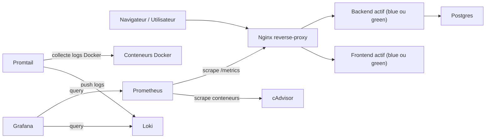

# Monitoring et observabilité

## Différence entre monitoring et observabilité

Le monitoring consiste à suivre des indicateurs connus à l'avance afin de savoir si l'application fonctionne correctement. On surveille par exemple le nombre de requêtes, la latence, le taux d'erreur ou l'utilisation CPU d'un conteneur.

L'observabilité va plus loin. Elle permet de comprendre pourquoi un problème se produit à partir des signaux produits par le système. Les trois piliers classiques sont :

- les métriques : valeurs numériques agrégées dans le temps
- les logs : événements détaillés générés par les services
- les traces : suivi d'une requête à travers plusieurs composants

Dans ce TP, les traces ne sont pas implémentées, mais elles font partie du modèle global d'observabilité.

## Rôle des composants

### Prometheus

Prometheus interroge périodiquement les services exposant des métriques HTTP. Dans cette stack, il scrute l'endpoint `/metrics` du backend actif via le reverse proxy Nginx, ainsi que `cadvisor` pour récupérer les métriques des conteneurs Docker.

### Grafana

Grafana permet de visualiser les données issues de Prometheus et Loki. Il est utilisé pour créer les dashboards de métriques backend et d'analyse de logs.

### Loki

Loki est la base de stockage et de requêtage pour les logs. Il indexe peu de métadonnées et reste donc léger par rapport à une stack ELK.

### Promtail

Promtail collecte les logs des conteneurs Docker, extrait des labels utiles comme `service`, `level` ou `statusCode`, puis envoie ces logs à Loki.

### cAdvisor

cAdvisor expose des métriques système et conteneur, notamment la consommation CPU et mémoire du backend. Il complète les métriques applicatives exposées par le backend lui-même.

## Architecture globale



## Intégration de l'application

L'application existante est composée d'un frontend Vue, d'un backend Node/Express et d'un reverse proxy Nginx utilisé pour le blue/green deployment. Pour éviter de modifier la configuration Prometheus à chaque changement de couleur active, le proxy expose maintenant `/metrics` et relaie cette route vers le backend actif. Ainsi, Prometheus scrute toujours la bonne version du backend.

Le backend expose des métriques Prometheus et écrit aussi des logs JSON structurés sur la sortie standard. Promtail les récupère directement depuis Docker et Loki les centralise pour l'exploration dans Grafana.

## Ports utilisés

| Composant | URL / Port | Rôle |
| --- | --- | --- |
| Grafana | http://localhost:3000 | Dashboards et exploration |
| Prometheus | http://localhost:9090 | Collecte et requêtage des métriques |
| Loki | `loki:3100` | Stockage des logs, exposé en interne |
| Promtail | `promtail:9080` | Collecte et envoi des logs |
| cAdvisor | http://localhost:8081 | Métriques conteneurs |
| Reverse proxy | http://localhost:80 | Point d'entrée applicatif et endpoint `/metrics` |

## Flux de données

1. Le backend actif expose `/metrics`.
2. Le reverse proxy relaie `/metrics` vers la couleur active.
3. Prometheus scrute régulièrement ce point d'entrée ainsi que `cadvisor`.
4. Les conteneurs écrivent leurs logs sur stdout.
5. Promtail découvre les conteneurs Docker, enrichit les logs avec des labels et les envoie à Loki.
6. Grafana interroge Prometheus pour les métriques et Loki pour les logs.

## Fichiers ajoutés pour le TP

- `docker-compose.monitoring.yml`
- `monitoring/prometheus/prometheus.yml`
- `monitoring/promtail/promtail-config.yml`
- `monitoring/loki/loki-config.yaml`
- `monitoring/grafana/provisioning/datasources/datasources.yml`
- `monitoring/grafana/provisioning/dashboards/dashboards.yml`
- `monitoring/grafana/dashboards/backend-metrics.json`
- `monitoring/grafana/dashboards/logs-correlation.json`

## Commandes utiles

### Lancer la stack applicative blue/green

```bash
docker network create gym-bluegreen-network || true
docker volume create gym-postgres-data || true
docker compose -f docker-compose.base.yml -f docker-compose.blue.yml up -d
```

### Lancer la stack monitoring

```bash
docker compose --env-file .env -f docker-compose.monitoring.yml up -d
```

### Vérifier les métriques

```bash
curl http://localhost/metrics
curl http://localhost:9090/api/v1/targets
```

### Vérifier les logs

```bash
docker logs monitoring-promtail
docker logs monitoring-loki
```
